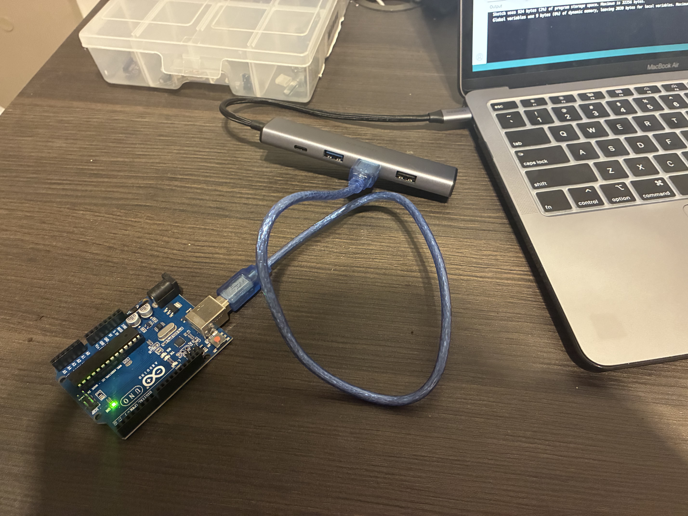
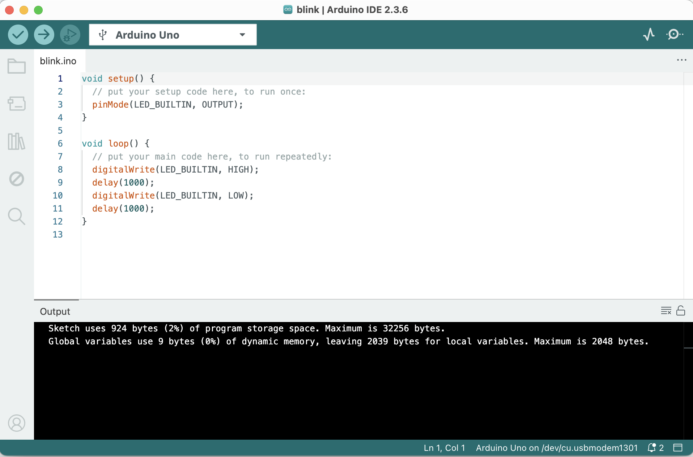
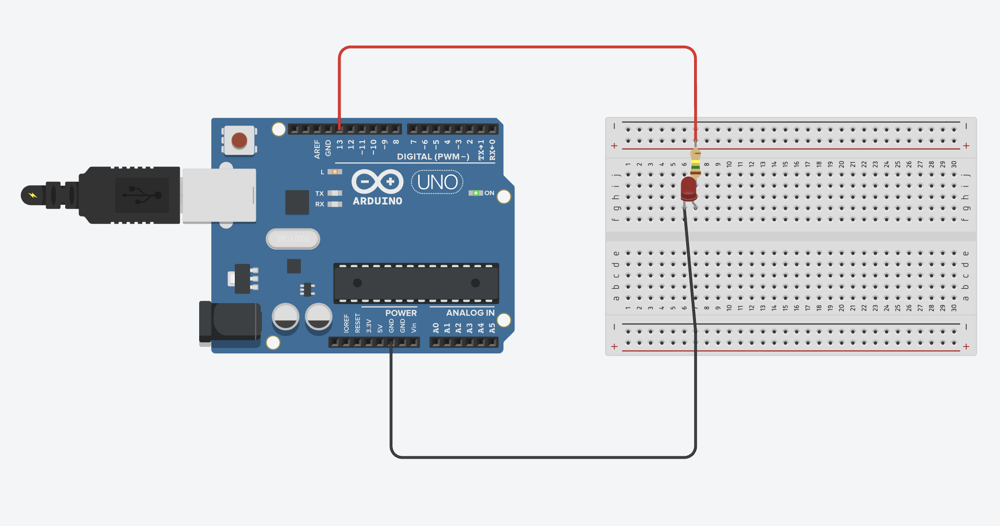
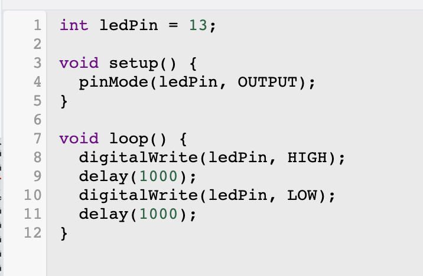

## Parte 1: Blink Led Interno

*Figura 1 — Demonstração do setup do arduino com o computador.*

---

*Figura 2 — Demonstração do código compilado na IDE do arduino interno.*

---

[*Led Interno Piscando Video Youtube*](https://youtube.com/shorts/8oJHcPjMlLw?feature=share) 

*Figura 3 — Demonstração em vídeo do código Blink.*

---

Utilizando a demonstração no vídeo [Como Instalar o Arduino IDE](https://www.youtube.com/watch?v=B6JMZWqPBsM) do canal [Sergio A. Castaño Giraldo - Brasil](https://www.youtube.com/@SergioACGiraldoBR), publicado no autoestudo da primeira semana, um setup foi montado conectando o Arduino Uno ao computador por meio de um adaptador.

O código exibido na *Figura 2* demonstra as duas funções que foram utilizadas para a execução do código: **setup()** e **loop()**. A primeira função configura o pino LED_BUILTIN como uma saída. A função **loop()** faz com o que o led pisque continuamente ao repetir comando para ligar e desligar a peça a cada intervalo de 1 segundo. 

## Parte 2: Simulando Blink Externo

*Figura 4 — Montagem no Tinkercad do LED externo (off-board) com resistor (~220 Ω) conectado ao pino digital 13 e ao GND.*

---

*Figura 5 — Código do Blink externo desenvolvido e compilado na IDE do Arduino/Tinkercad.*

---

[*Led Vermelho Piscando Video Youtube*](https://youtu.be/tt5jh-Ffpww) 

*Figura 6 — Demonstração em vídeo do Blink externo funcionando na simulação do Tinkercad.*

---

Nesta simulação usando o sistema Tinkercad, foi criado um circuito utilizando led externo, resistor (150 Ω), e o Arduino Uno conectado a um protoboard.

O **ânodo** (perna longa) do LED foi ligado ao **pino digital 13** através do resistor, enquanto o **cátodo** (perna curta) foi conectado ao **GND**.

O programa utiliza as funções **setup()** e **loop()** para controlar o piscar do LED. O processo é o mesmo da **Parte 1** mas agora utilizando como output o pino 13, que leva ao led.

- [*Link do projeto no Tinkercad*](https://www.tinkercad.com/things/9fbCA0mwjKM-circuito-basico-para-piscar?sharecode=rQsXlqdIloNtEtb0-GIutjR0BbabDjJmf2Iu-xjsdZU)  
