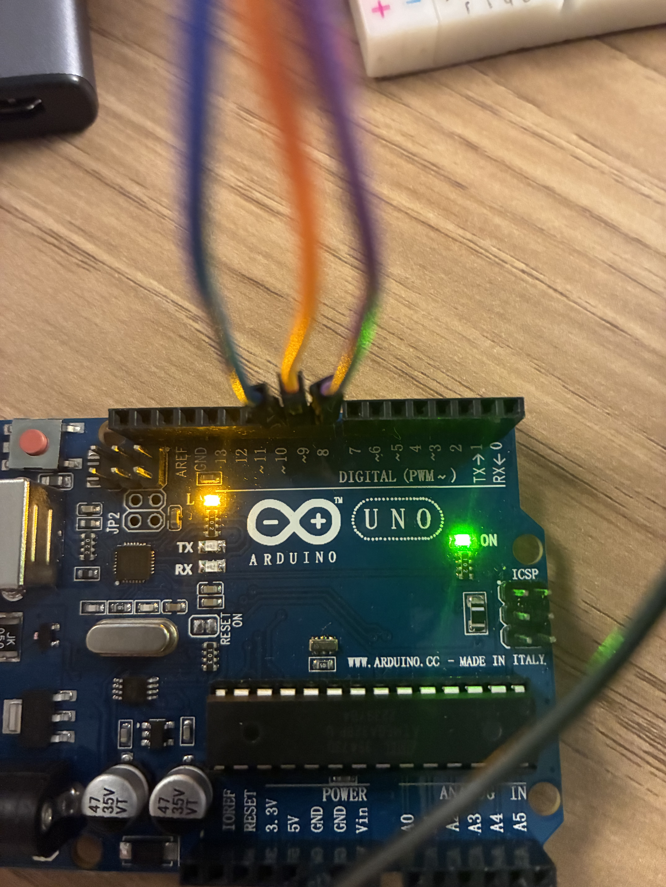
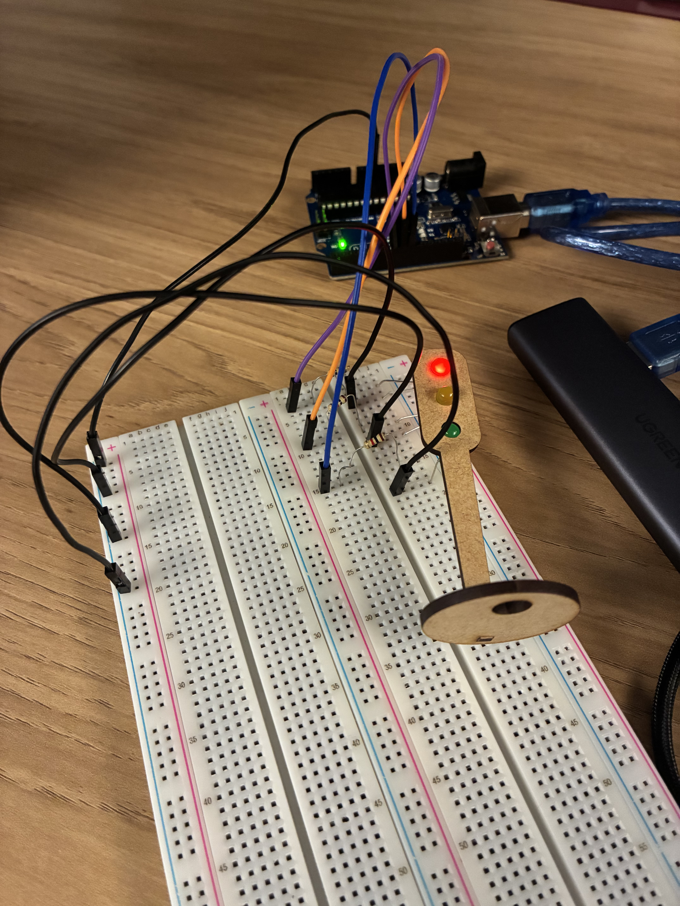

# Semáforo com Arduino

## Descrição
Projeto de um semáforo simples utilizando **Arduino UNO**, **três LEDs** e **resistores de 1 kΩ**.  
Os LEDs acendem e apagam conforme os tempos definidos no código:
- Vermelho: **6 segundos**
- Amarelo: **2 segundos**
- Verde: **4 segundos**

---

## Materiais

| Componente   | Quantidade | Especificação | Observação |
|---------------|-------------|----------------|-------------|
| LED vermelho  | 1 | 5 mm | Parada (6 s) |
| LED amarelo   | 1 | 5 mm | Atenção (2 s) |
| LED verde     | 1 | 5 mm | Siga (4 s) |
| Resistor      | 3 | 1 kΩ | Um por LED |
| Jumpers       | Diversos | Macho-macho | Conexões |
| Protoboard    | 1 | 400 pontos | Montagem |
| Arduino UNO   | 1 | — | Microcontrolador |

---

## Montagem

- Pino **8** → LED vermelho → resistor 1 kΩ → GND  
- Pino **9** → LED amarelo → resistor 1 kΩ → GND  
- Pino **10** → LED verde → resistor 1 kΩ → GND  




*Figura 1 — Conexão no arduino (pinos 8, 9 e 10 e GND).*


*Figura 2 — Demonstração funcional.*


*Figura 3 — Montagem conectando LEDs (pinos 8, 9 e 10) com resistores e GND.*

## Demonstração em vídeo

Vídeo mostrando o semáforo em funcionamento:

<iframe src="https://drive.google.com/file/d/1xRX-aaKz2WEcl97C4o-QmsNeICQRFjiU/preview" width="640" height="360" allow="autoplay; encrypted-media" allowfullscreen></iframe>

Link alternativo: [Assistir no Google Drive](https://drive.google.com/file/d/1xRX-aaKz2WEcl97C4o-QmsNeICQRFjiU/view?usp=drive_link)

Se o vídeo não carregar, verifique se o arquivo está compartilhado publicamente.

## Justificativa das Conexões

Cada ligação foi feita de forma a garantir o funcionamento correto e seguro dos componentes:

- **Pinos digitais (8, 9 e 10):** utilizados para controlar individualmente cada LED, permitindo acender e apagar de forma programada via código.  
- **LEDs:** transformam o sinal elétrico dos pinos em luz, simulando as fases de um semáforo (vermelho, amarelo e verde).  
- **Resistores de 1 kΩ:** limitam a corrente elétrica que passa pelos LEDs, evitando que queimem.  
- **GND (terra):** completa o circuito elétrico, permitindo o fluxo de corrente entre o pino de saída e o aterramento.  
- **Protoboard e jumpers:** usados apenas para facilitar a montagem sem solda, permitindo reorganizar o circuito de forma simples e segura.

---

## Código

```cpp
class Led {
private:
  int color, pin, state, waitDelay;

public:
  Led(int c, int p, int s, int d)
    : color(c), pin(p), state(s), waitDelay(d) {}

  void toggle() {
    digitalWrite(pin, state ? LOW : HIGH);
    state = !state;
  }

  void waitTime() { delay(waitDelay * 1000); }
  int getPin() { return pin; }
};

Led leds[] = {
  Led(0, 8, 0, 6),
  Led(1, 9, 0, 2),
  Led(2, 10, 0, 4)
};

void setup() {
  for (auto& led : leds) pinMode(led.getPin(), OUTPUT);
}

void loop() {
  for (auto& led : leds) {
    led.toggle();
    led.waitTime();
    led.toggle();
  }
}